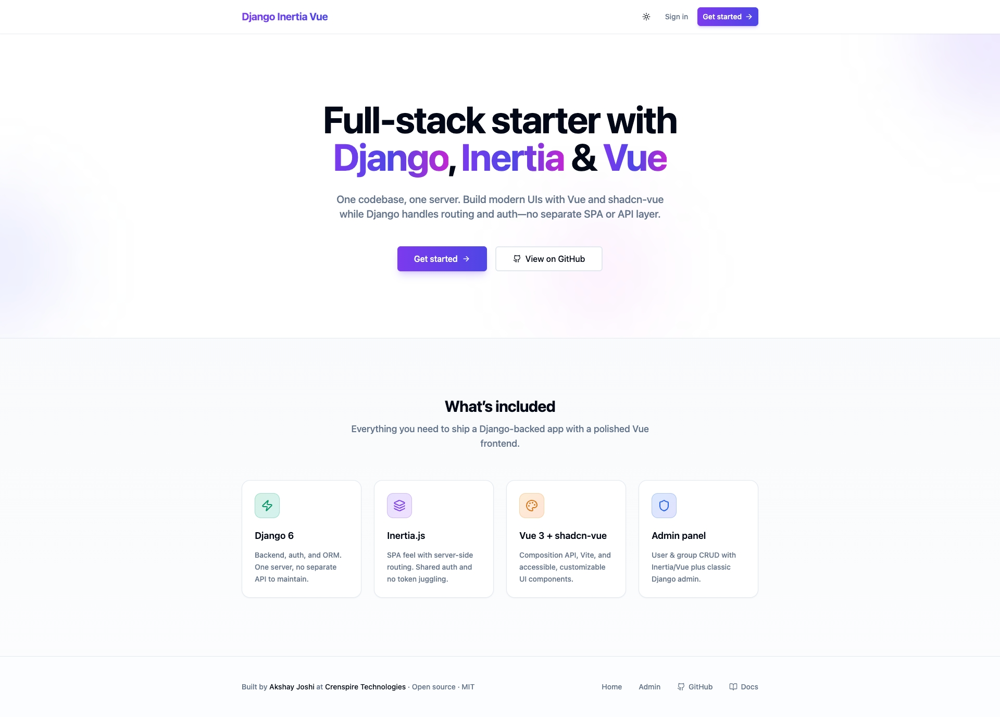
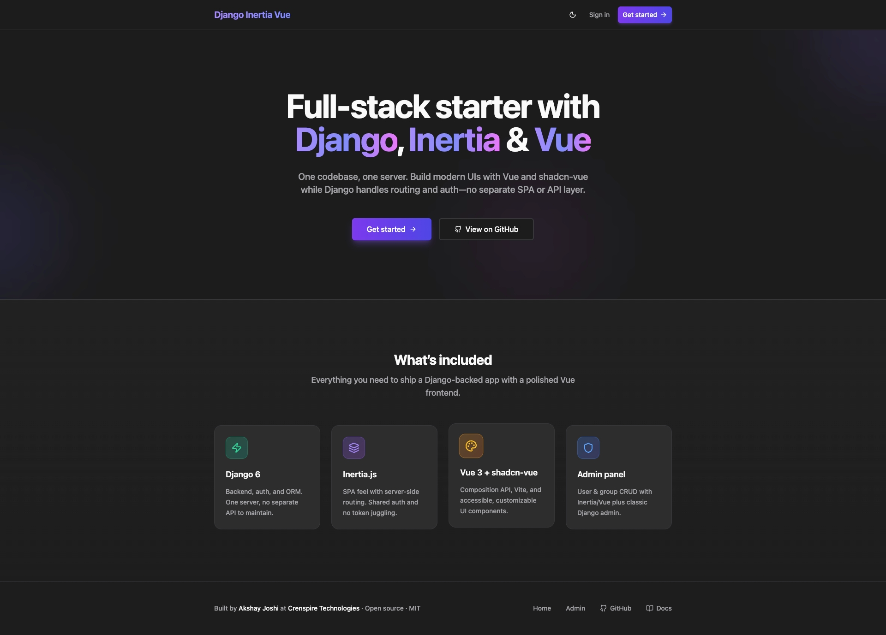
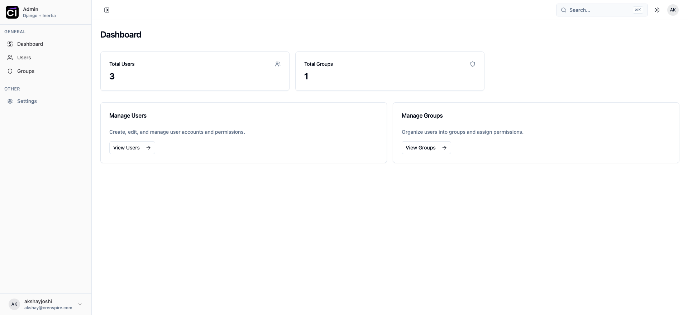
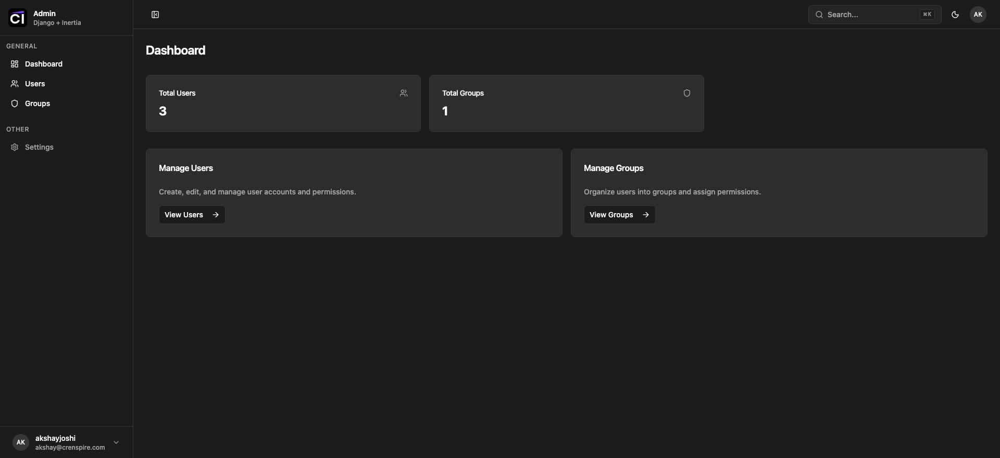
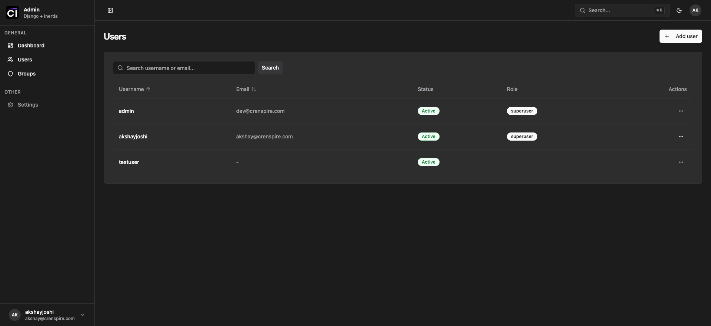
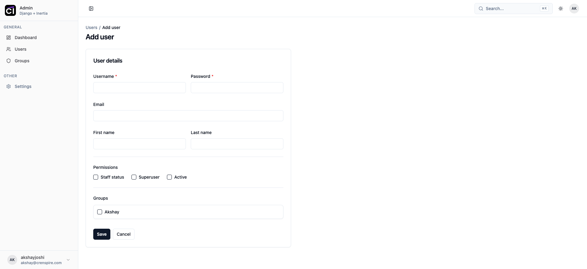

# Django Inertia Vue shadcn Starter Kit

A modern, open-source starter for full-stack web apps: **Django** on the backend, **Inertia.js** + **Vue 3** + **Vite** on the frontend, and **shadcn-vue** for UI components. No separate SPA deployment—one Django app, one codebase.

## Features

- **Django 6** – Backend, auth, and API
- **Inertia.js** – SPA-like UX without a separate frontend API; server-side routing, shared auth
- **Vue 3** (Composition API, `<script setup>`) – Reactive UI
- **Vite** – Fast dev server and builds
- **shadcn-vue** – Accessible, customizable components (Button, Card, Dialog, Table, etc.)
- **Tailwind CSS** – Utility-first styling with dark mode
- **Included admin** – User & group CRUD with Inertia/Vue (plus classic Django admin at `/django-admin/`)

## Quick start

### Prerequisites

- Python 3.11+ (e.g. [uv](https://github.com/astral-sh/uv) or `pyenv`)
- Node.js 18+

### Run the app

1. **Backend** (from repo root):

   ```bash
   uv run python starterkit/manage.py runserver
   ```

2. **Frontend** (Vite dev server in another terminal):

   ```bash
   cd starterkit/frontend
   npm install
   npm run dev
   ```

3. Open **http://127.0.0.1:8000** for the landing page, or **http://127.0.0.1:8000/admin/login/** to sign in. Create a staff user via Django shell or `/django-admin/` if needed.

### Routes

| Path | Description |
|------|-------------|
| `/` | Landing page (hero, features, footer) |
| `/admin/login/` | Admin login |
| `/admin/` | Dashboard (requires login) |
| `/admin/users/`, `/admin/groups/` | User & group management |
| `/django-admin/` | Classic Django admin |

## Screenshots

### Landing page

| Light | Dark |
|-------|------|
|  |  |

### Admin dashboard

| Light | Dark |
|-------|------|
|  |  |

### Users

**List**



**Create**



## Project structure

```
starterkit/
├── main/                 # Django project (settings, urls, middleware)
├── apps/
│   ├── users/            # User model & auth
│   └── admin_panel/      # Inertia admin (views, services, selectors)
├── frontend/             # Vue + Vite + Inertia
│   ├── Pages/            # Inertia pages (Admin/*, Auth/*, Home.vue)
│   ├── Layouts/          # AdminLayout, AuthLayout
│   ├── Components/       # ui/* (shadcn), admin/*
│   └── app.js            # Inertia app entry
├── static_assets/        # Static files (icon, screenshots) – served at /static/
├── templates/            # Django base template (Inertia mount)
└── manage.py
```

## Tests

```bash
uv run python starterkit/manage.py test apps.admin_panel.tests
```

## License

MIT. Use this starter for personal or commercial projects.
