# Django Inertia Vue shadcn Starter Kit

A modern full-stack starter: **Django 6** on the backend, **Inertia.js v3 + Vue 3 + Vite** on the frontend, and a polished **shadcn-vue** admin out of the box. One codebase, one server, no separate API or SPA to deploy.

<picture>
  <source media="(prefers-color-scheme: dark)" srcset="docs/screenshots/dashboard-dark.png">
  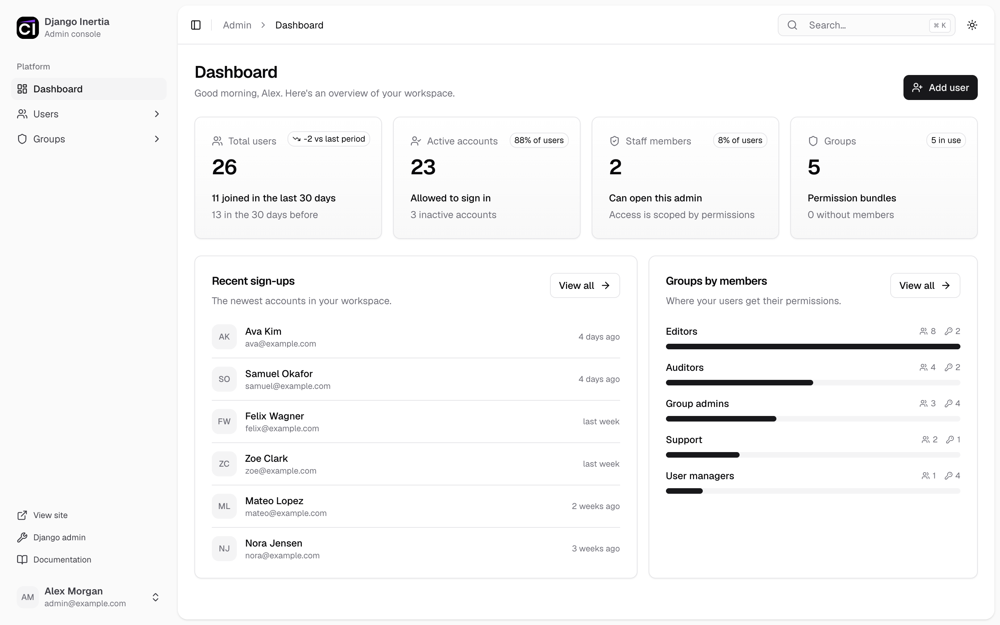
</picture>

## Features

- **Django 6** with a custom user model, environment-based settings and production security defaults
- **Inertia.js v3**: server-side routing and auth with an SPA feel; Django messages show up as toasts
- **Vue 3 + Vite 8** with hot reload in development and hashed, cache-busted bundles in production (via django-vite)
- **shadcn-vue admin** built from shadcn's own blocks: inset collapsible sidebar, breadcrumbs, <kbd>⌘K</kbd> command menu, data tables, light/dark/system themes, and a mobile slide-out sidebar
- **User & group management** with search, sorting, pagination, and permission-aware forms
- **Safe permissions** that mirror Django admin, plus guards against privilege escalation ([details](docs/permissions.md))
- **Tested**: 60 backend tests covering services, selectors, views and permissions
- **Demo data** in one command (`seed_demo`) to explore the admin immediately

## Screenshots

| Sign in | Users |
|---------|-------|
| 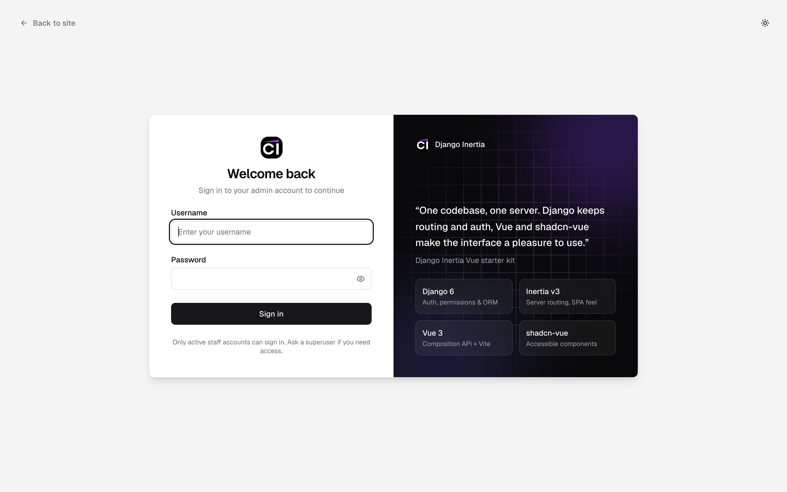 | 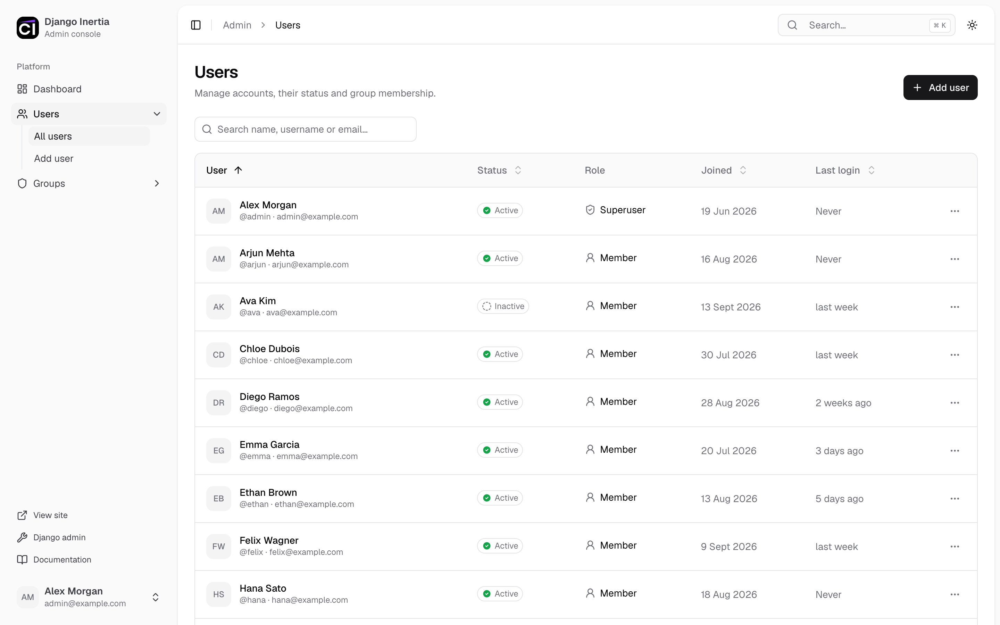 |
| **Edit user** | **Group permissions** |
| 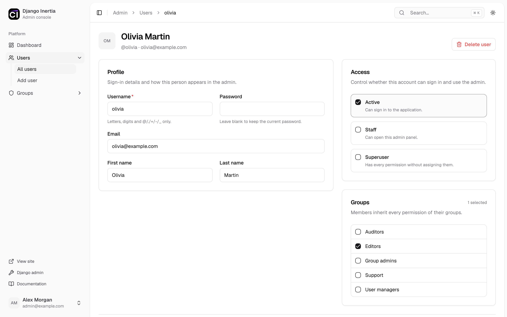 | 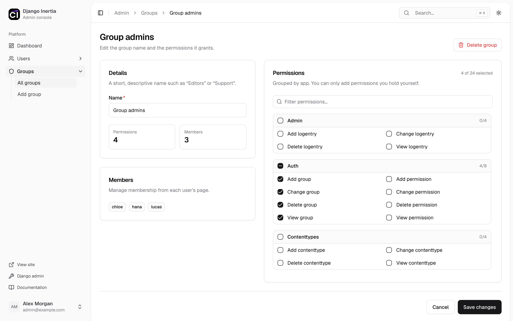 |
| **Command menu (⌘K)** | **Collapsed sidebar (⌘B)** |
| 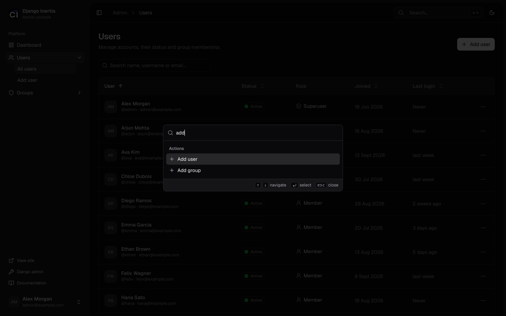 | 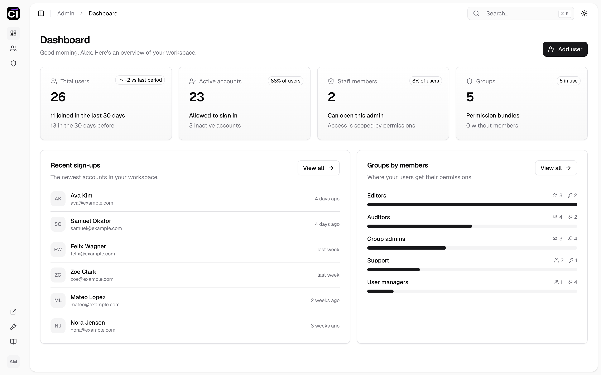 |

<details>
<summary><strong>Mobile</strong></summary>
<br>

<p>
  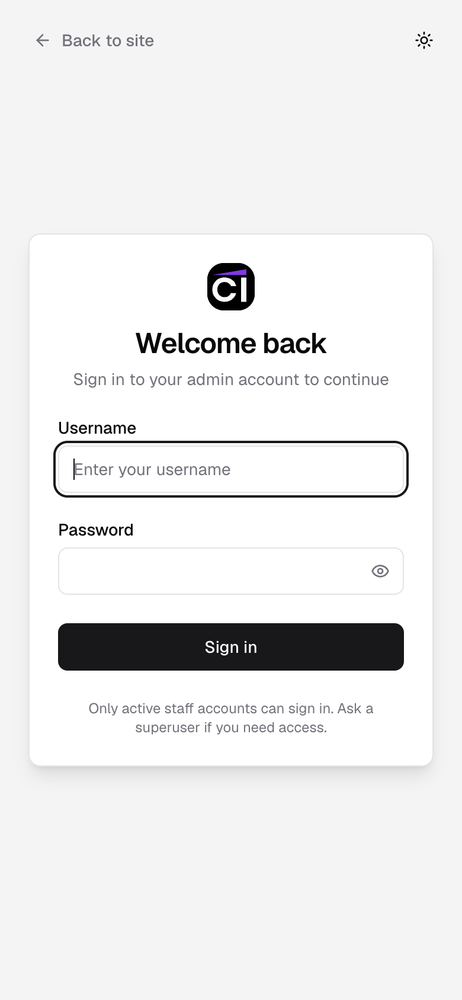
  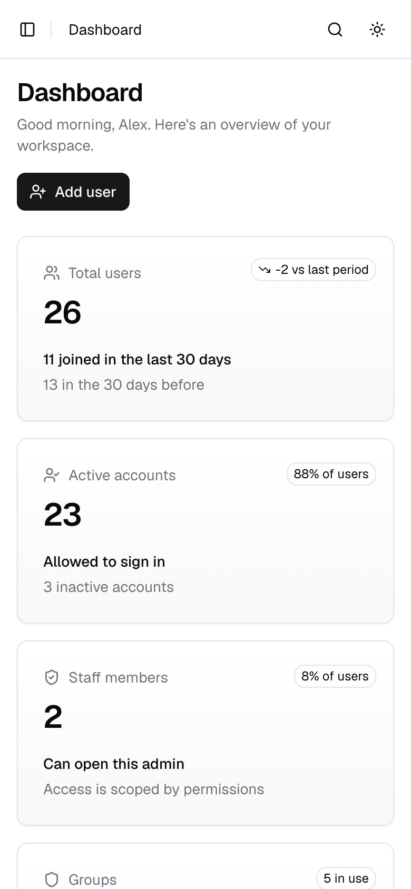
  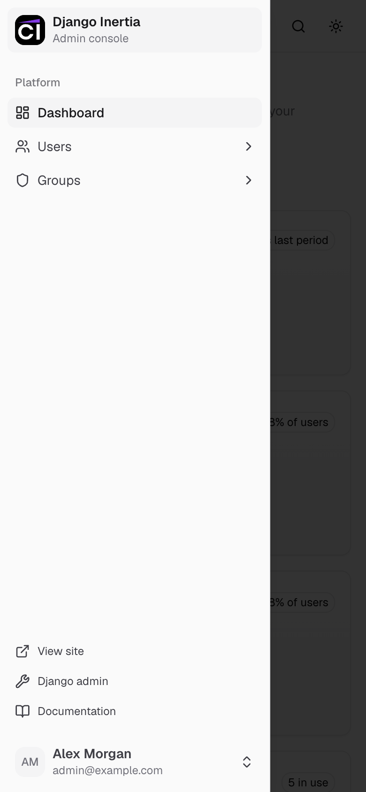
  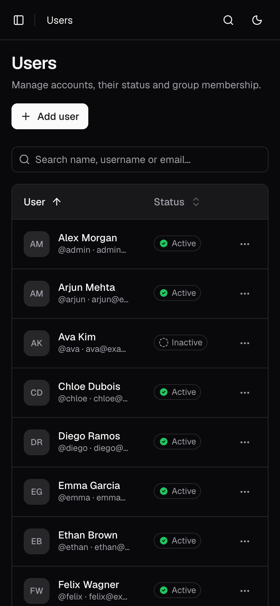
</p>
</details>

<details>
<summary><strong>Dark mode, landing page and limited-permission view</strong></summary>
<br>

| Users (dark) | Sign in (dark) |
|--------------|----------------|
| 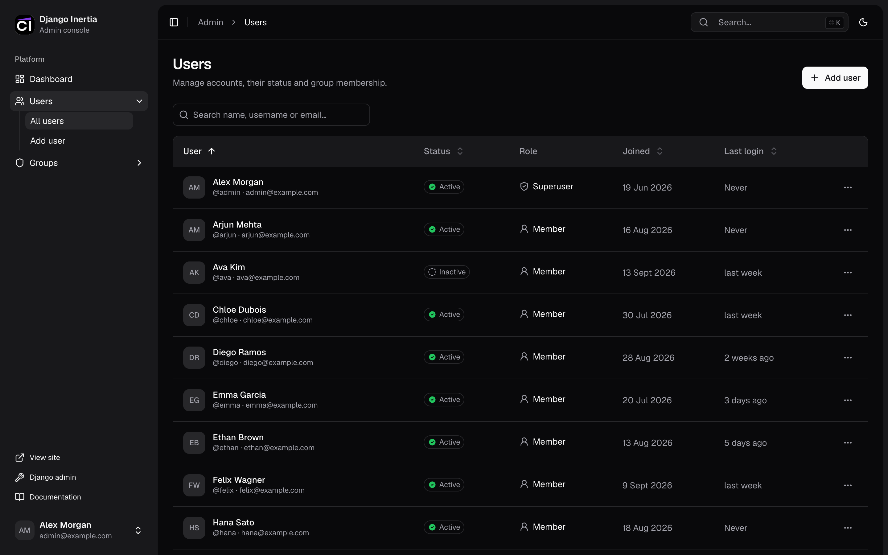 | 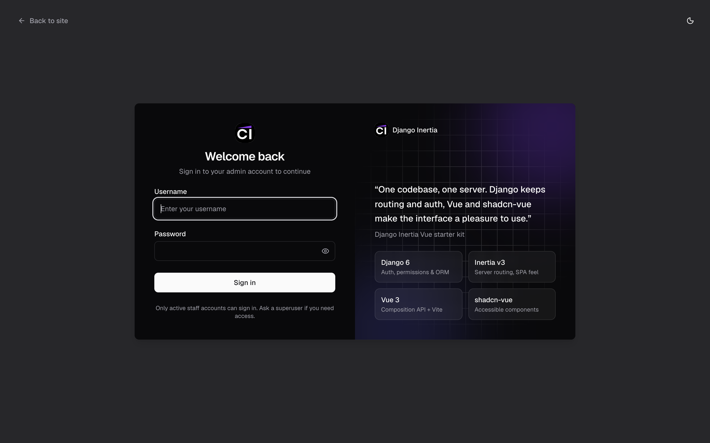 |
| **Landing page** | **Staff user without group permissions** |
| 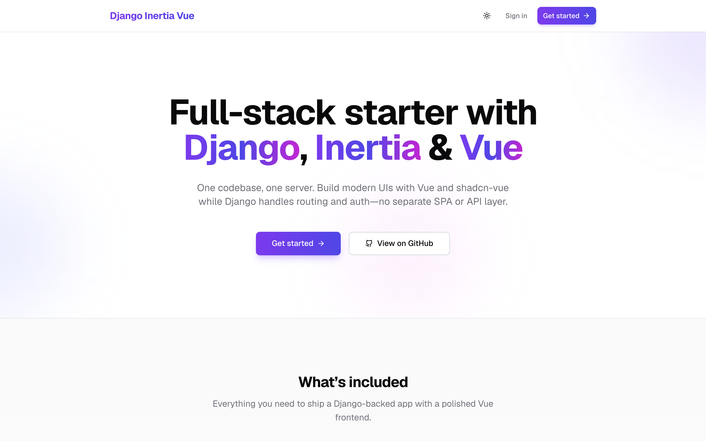 | 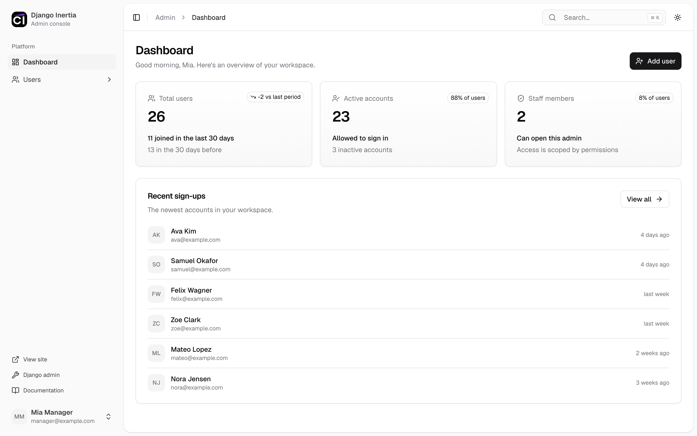 |
</details>

## Quick start

Requires **Python 3.13** with [uv](https://docs.astral.sh/uv/), and **Node.js** `^20.19` or `>=22.12`.

```bash
git clone https://github.com/crenspire/django-vue-boilerplate.git
cd django-vue-boilerplate

uv sync
uv run python starterkit/manage.py migrate
uv run python starterkit/manage.py seed_demo      # or: createsuperuser
uv run python starterkit/manage.py runserver
```

In a second terminal:

```bash
cd starterkit/frontend
npm install
npm run dev
```

Open **http://127.0.0.1:8000/admin/** and sign in as `admin` / `demo-password-123`.

## Documentation

| | |
|---|---|
| [Getting started](docs/getting-started.md) | Setup, demo data, shortcuts, troubleshooting |
| [Architecture](docs/architecture.md) | Request flow, backend layers, shared props, flash messages |
| [Frontend & UI](docs/frontend.md) | Layouts, shadcn-vue components, theming, navigation, tables |
| [Permissions](docs/permissions.md) | Access rules and escalation guards |
| [Tutorial: adding an admin page](docs/guides/adding-an-admin-page.md) | Build a new page end to end |
| [Testing](docs/testing.md) | Running and writing tests |
| [Deployment](docs/deployment.md) | Environment variables, builds, production checklist |

## Tech stack

| Layer | Tools |
|-------|-------|
| Backend | Django 6, inertia-django 2, django-vite 3, SQLite (swap for Postgres) |
| Frontend | Vue 3, @inertiajs/vue3 3, Vite 8, Tailwind CSS 3 |
| UI | shadcn-vue (reka-ui), lucide icons, vue-sonner, Geist font |
| Tooling | uv, npm |

## Project structure

```
starterkit/
├── main/              # settings, urls, shared Inertia props
├── apps/
│   ├── users/         # custom User model
│   └── admin_panel/   # api/ domain/ forms/ services/ selectors/ dto/ tests/
├── frontend/
│   ├── Pages/         # Inertia pages (Admin/*, Auth/*, Home.vue)
│   ├── Layouts/       # AdminLayout, AuthLayout
│   ├── Components/    # ui/* (shadcn-vue) and admin/* (sidebar, header, forms, tables)
│   └── composables/   # navigation, theme, list query state
├── templates/         # base.html (Inertia mount + django-vite tags)
└── static_assets/     # favicon and other static files
docs/                  # guides and README screenshots
```

## Running tests

```bash
uv run python starterkit/manage.py test apps
```

## License

[MIT](LICENSE) — free for personal and commercial projects.
