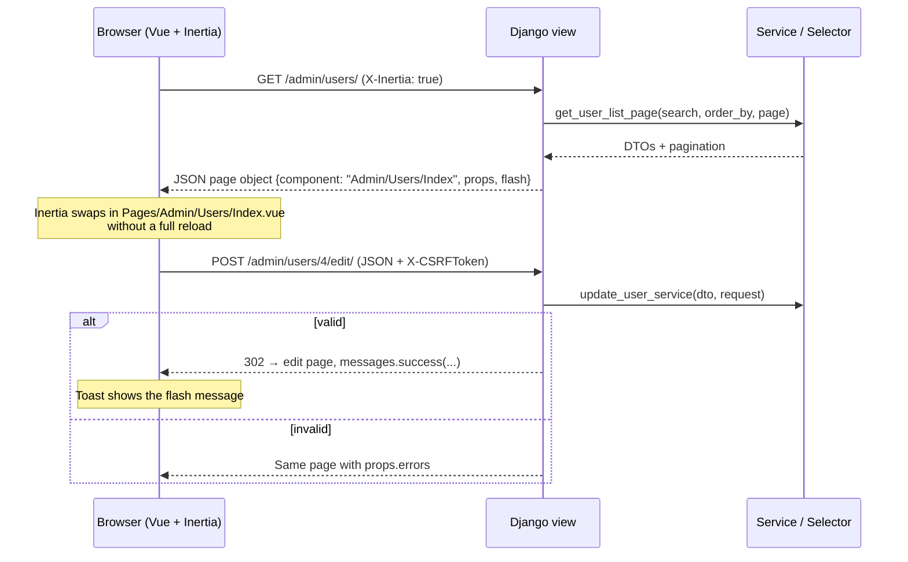

# Architecture

The app is a single Django project. Django owns routing, authentication, permissions and data; Vue renders pages. [Inertia.js](https://inertiajs.com/) connects them, so there is no REST/GraphQL API to design and no separate SPA to deploy.

## Request flow



- **First visit:** Django renders `templates/base.html` with the page object embedded as JSON; `frontend/app.js` boots Vue from it.
- **Later visits:** Inertia requests the next page as JSON and swaps the component. Layouts are *persistent*, so the sidebar and header stay mounted between pages.

## Backend layout

```
starterkit/
├── main/                   # settings, urls, shared Inertia props (middleware.py)
└── apps/
    ├── users/              # custom User model (AUTH_USER_MODEL = "users.User")
    └── admin_panel/
        ├── api/            # views: parse the request, call a service/selector, render
        ├── domain/         # policies.py (who may do what), grants.py (what they may hand out)
        ├── forms/          # Django forms: every validation rule lives here
        ├── services/       # writes (create/update/delete), return result DTOs
        ├── selectors/      # reads, pagination, dashboard aggregates
        ├── dto/            # frozen dataclasses passed between layers
        ├── management/     # seed_demo command
        └── tests/
```

The layers keep responsibilities narrow:

| Layer | Does | Doesn't |
|-------|------|---------|
| `api/` views | Read query params and bodies (`request_utils.py`), guard with `@admin_view(policy)`, render Inertia pages, add flash messages | Query the ORM directly or validate fields |
| `services/` | Check object-level permissions, run a Django form, save inside a transaction | Know about Inertia or HTTP responses |
| `selectors/` | Build querysets, annotate counts, paginate with Django's `Paginator` | Write data |
| `forms/` | Validate (username rules, uniqueness, email, password validators, grant limits) | Decide who may open a page |
| `domain/` | Pure permission rules | Touch the request |

## Shared props and flash messages

`main/middleware.py` shares one prop with every page:

```json
{
  "auth": {
    "user": {
      "id": 1, "username": "admin", "email": "admin@example.com",
      "first_name": "Alex", "last_name": "Morgan",
      "is_staff": true, "is_superuser": true,
      "permissions": { "view_users": true, "add_users": true, "...": true }
    }
  }
}
```

It is computed lazily, so it only runs when an Inertia page is rendered. `permissions` lets the UI hide actions the user can't take; the server enforces them regardless.

Flash messages use Django's standard messages framework. inertia-django 2.x puts them on the page object as `flash.messages`, and `Components/admin/FlashToaster.vue` shows each one as a toast:

```python
from django.contrib import messages

messages.success(request, "User “olivia” was saved.")
return redirect("admin_user_edit", user_id=user.id)
```

## Validation errors

Services return `{field: [messages]}`. On failure the view re-renders the same page with `errors` (and the submitted `form` values, minus passwords). Forms read errors from props, for example `errors.username[0]`. Non-field errors come through as `errors.non_field_errors` and appear in an alert at the top of the form.

## Asset pipeline

| Mode | Where JS/CSS come from | Controlled by |
|------|------------------------|---------------|
| Development | Vite dev server with hot reload (``, ``) | `DJANGO_VITE_DEV_MODE` (defaults to `DJANGO_DEBUG`) |
| Production | Hashed files in `frontend/dist`, looked up in `manifest.json` | `npm run build` + `collectstatic` |

`INERTIA_VERSION` is a hash of the manifest, so open browser tabs do a full reload after a deploy instead of running stale JavaScript.
